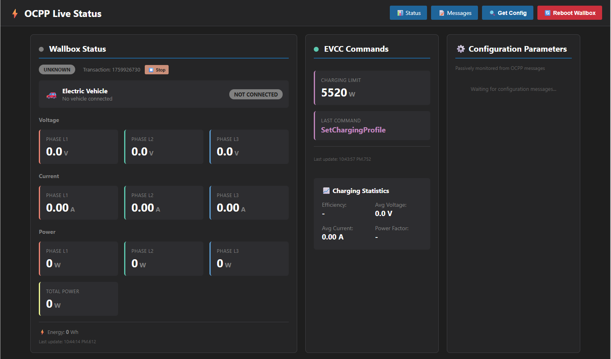

# ⚡ Wallbox EVCC Proxy

A WebSocket proxy service that fixes communication issues between electric vehicle wallbox chargers and EVCC (Electric Vehicle Charge Controller) systems.

## ✨ What It Does

- **Fixes malformed URLs**: Converts `ws://host:port//path` → `ws://host:port/path`
- **Handles OCPP protocol**: Manages OCPP 1.6 subprotocol negotiation
- **Fixes timestamps**: Corrects invalid timestamp formats in OCPP messages
- **Auto-configuration**: Automatically configures wallbox on BootNotification
  - LocalPreAuthorize = true
  - LocalAuthorizeOffline = false
  - LocalAuthListEnabled = false
  - AuthorizeRemoteTxRequests = false (enables RFID authorization)
- **Web monitoring interface**: Real-time OCPP message viewer (port 8889)
- **Comprehensive logging**: Console and file logging for monitoring
- **Automatic restart**: Runs as systemd service with auto-restart



## 🌐 Network Setup

```
[Wallbox] ←→ [Proxy:8888] ←→ [EVCC:8887]
```

- **Wallbox**: Connect to proxy at `ws://proxy-host:8888/path`
- **Proxy**: Runs on port 8888, forwards to EVCC
- **EVCC**: Receives cleaned connections on port 8887

## 🚀 Quick Start

### 📦 Installation

1. Clone the repository:
   ```bash
   git clone https://github.com/SensorsIot/Wallbox-EVCC-Proxy.git
   cd Wallbox-EVCC-Proxy
   ```

2. Make the script executable:
   ```bash
   chmod +x ocpp_proxy.py
   ```

3. Create systemd service file:
   ```bash
   sudo tee /etc/systemd/system/ocpp-proxy.service > /dev/null << 'EOF'
   [Unit]
   Description=OCPP WebSocket Proxy
   After=network.target

   [Service]
   Type=simple
   User=root
   WorkingDirectory=/home/OCPP-Proxy
   ExecStart=/home/OCPP-Proxy/ocpp_proxy.py --listen-port 8888 --target-host 192.168.0.202 --target-port 8887
   Restart=always
   RestartSec=5
   StandardOutput=journal
   StandardError=journal

   [Install]
   WantedBy=multi-user.target
   EOF
   ```

4. Enable and start the service:
   ```bash
   sudo systemctl daemon-reload
   sudo systemctl enable ocpp-proxy.service
   sudo systemctl start ocpp-proxy.service
   ```

### 🎯 Usage

**Manual run:**
```bash
./ocpp_proxy.py --listen-port 8888 --target-host 192.168.0.202 --target-port 8887 --web-port 8889
```

**Web Interface:**
The proxy includes a built-in web interface with two pages:

**📝 Messages Page** (`http://192.168.0.150:8889/`)
  - Real-time OCPP message display
  - Color-coded message directions (Wallbox ↔ EVCC)
  - Message type indicators (CALL, RESULT, ERROR)
  - Tag highlights for converted/blocked messages
  - Auto-refresh every 2 seconds
  - Click messages to expand/collapse JSON payloads
  - Clear message buffer button
  - Keeps last 500 messages in memory

**📊 Live Status Dashboard** (`http://192.168.0.150:8889/status`)
  - Real-time electrical measurements from wallbox:
    - Voltage per phase (L1, L2, L3)
    - Current per phase (L1, L2, L3)
    - Power per phase + total power
    - Energy consumption
  - EVCC charging commands:
    - Current charging limit (Watts)
    - Last command sent
  - Charging statistics:
    - Efficiency (actual vs requested power)
    - Average voltage and current
    - Power factor estimate
  - Live indicators for charging status
  - Auto-updates every second when messages are processed
  - Transaction ID tracking


**Service management:**
```bash
sudo systemctl status ocpp-proxy.service    # Check status
sudo systemctl restart ocpp-proxy.service   # Restart
sudo systemctl stop ocpp-proxy.service      # Stop
```

**View logs:**
```bash
# Service logs
sudo journalctl -u ocpp-proxy.service -f

# OCPP message logs (raw)
tail -f /home/OCPP-Proxy/ocpp_messages.log

# OCPP message logs (formatted for humans)
./format_logs.py ocpp_messages.log                 # Detailed format with colors
./format_logs_compare.py ocpp_messages.log         # Side-by-side comparison format
./format_logs.py ocpp_messages.log --no-payload    # Hide payloads
./format_logs.py ocpp_messages.log --show-raw      # Show raw JSON
```

## 📚 Documentation

- **[Functional Specification](Wallbox-EVCC-Proxy-FSD.md)**: Complete technical specification
- **Configuration**: See command-line options with `./ocpp_proxy.py --help`

## 📋 Requirements

- Python 3.7+
- `websockets` library
- Linux with systemd (for service mode)

## 📄 License

Open source project for the EV charging community.